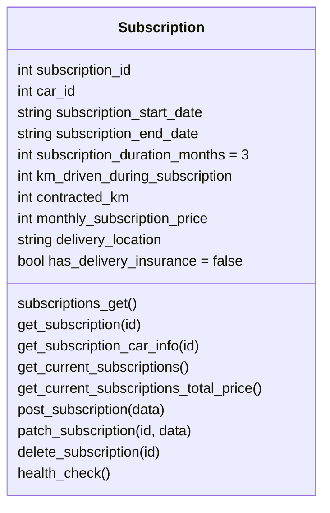

# Car Subscription Microservice

## Table of Contents
1. [Overview](#overview)
   - [Domain Model](#domain-model)
   - [Microservice Architecture](#microservice-architecture)
2. [Features](#features)
3. [JWT](#jwt)
4. [Database Structure (ERD)](#database-structure-erd)
5. [Technology Stack](#technology-stack)
6. [Environment Variables](#environment-variables)
7. [Endpoints](#endpoints)
   - [Base URL](#base-url)
   - [Endpoint Documentation](#endpoint-documentation)
8. [Swagger Documentation](#swagger-documentation)

## Overview
The Car Subscription Microservice manages subscriptions related to car rentals. It handles CRUD operations for subscriptions, integrates with other services to retrieve car information, and calculates total subscription prices. This service plays a crucial role in managing user subscriptions within the overall car rental application.

### Microservice Architecture
This microservice is part of a larger application, interacting with other services (e.g., car microservice) to provide a seamless user experience.

## Features
- **CRUD Operations**: Create, Read, Update, Delete subscriptions.
- **Integration**: Fetch car information from an external service.
- **Authentication**: Role-based access control using JWT.
- **Health Check**: Endpoint to check the service health status.

## JWT
This service uses JSON Web Tokens (JWT) for authentication and role-based access control.

## Domain Model Snippet - todo mermaid

## Technology Stack
- **Programming Language**: Python
- **Framework**: Flask
- **Database**: SQLite3
- **API Documentation**: Swagger/OpenAPI
- **Deployment**: Azure Web App (using Docker container)
- **CI/CD**: GitHub Actions

## Environment Variables
| Variable            | Description                                      |
|---------------------|--------------------------------------------------|
| SECRET_KEY          | Secret key for the application                   |
| DB_PATH             | Path to the SQLite database                      |
| ADMIN_EMAIL         | Email of the admin microservice user                          |
| ADMIN_PASSWORD      | Password for the admin microservice user                      |
| ADMIN_GATEWAY_URL   | URL for the admin gateway service                |

## Endpoints
### Base URL
- **Local**: http://localhost:5006
- **Production (Azure)**: https://abonnement-microservice-dkeda4efcje4aega.northeurope-01.azurewebsites.net

### Endpoint Documentation
| Method | Endpoint                                 | Description                            | Example Request Body                                                        | Response Codes          | Role Required          |
|--------|------------------------------------------|----------------------------------------|-----------------------------------------------------------------------------|-------------------------|------------------------|
| GET    | /subscriptions                           | Retrieve all subscriptions             | N/A                                                                         | 200, 204, 401, 404, 500 | admin, finance, sales  |
| GET    | /subscriptions/<int:id>                  | Retrieve a subscription by ID          | N/A                                                                         | 200, 401, 404, 500      | admin, sales           |
| GET    | /subscriptions/<int:id>/car              | Retrieve car info for a subscription   | N/A                                                                         | 200, 401, 404, 500      | admin, sales           |
| GET    | /subscriptions/current                   | Retrieve current active subscriptions  | N/A                                                                         | 200, 204, 401, 404, 500 | admin                  |
| GET    | /subscriptions/current/total-price       | Retrieve total price of current subscriptions | N/A                                                                  | 200, 401, 500           | admin, finance         |
| POST   | /subscriptions                           | Create a new subscription              | `{"user_id": 1, "car_id": 1, "subscription_start_date": "2023-01-01", "subscription_end_date": "2023-12-31"}` | 201, 401, 400, 500      | admin, sales           |
| PATCH  | /subscriptions/<int:id>                  | Update an existing subscription        | `{"subscription_start_date": "2023-01-01", "subscription_end_date": "2023-12-31"}` | 200, 401, 400, 500      | admin, sales           |
| DELETE | /subscriptions/<int:id>                  | Delete a subscription                  | N/A                                                                         | 200, 401, 404, 500      | admin, sales           |
| GET    | /health                                  | Health check for the service           | N/A                                                                         | 200, 500                | N/A                    |

## Swagger Documentation 
Swagger UI is available at [`<Base URL>/docs`](https://abonnement-microservice-dkeda4efcje4aega.northeurope-01.azurewebsites.net/docs).